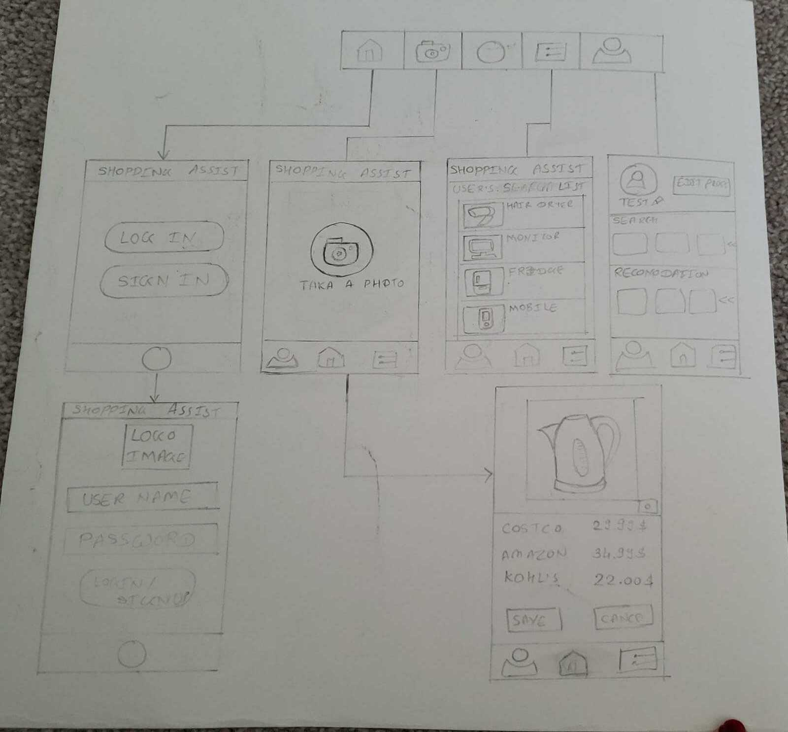
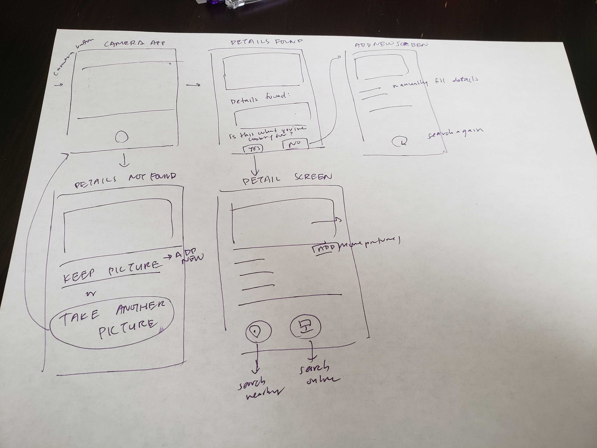
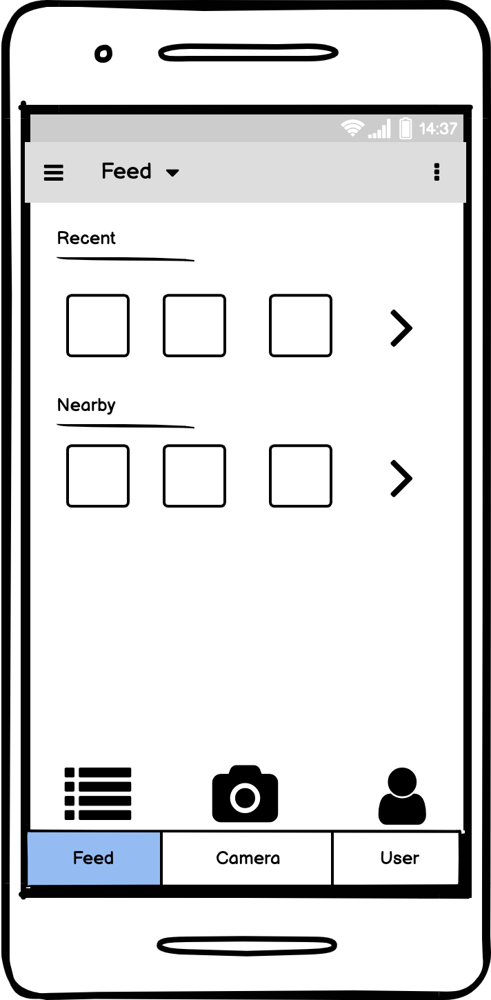
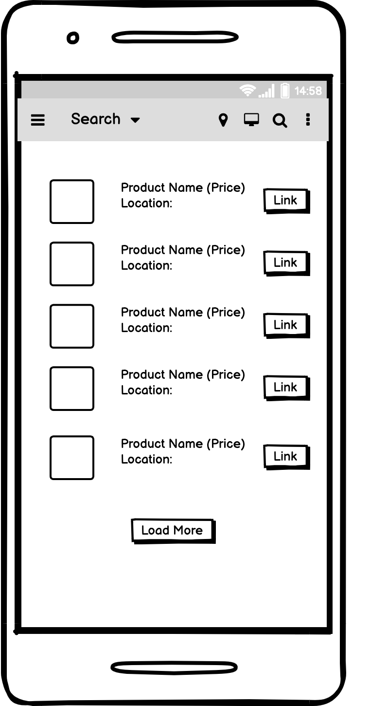

===

# Shopping Assistant

## Table of Contents
1. [Overview](#Overview)
1. [Product Spec](#Product-Spec)
1. [Wireframes](#Wireframes)
2. [Schema](#Schema)

## Overview
### Description

An app that can assist you with your shopping. Take a picture and upload it to the app. The app will search for details about the item online, including the price, product details, where to find it in person or online, and items that might be similar to it. It can also save items that you've found but want to buy later.

### App Evaluation
- **Category:**
    - Shopping 
- **Mobile:**
    - User will be able to use their phone and take pictures of items.
    - The app can add additional information automatically, such as location that the picture was taken (i.e. which store they found the item).
    - In addition, a user will be able to scan an item and get a list of nearby stores with the item in stock (i.e. nearby stores holding the same item)
- **Story:**
    - When looking to purchase an item in store, you can use this app to get additional information that might not be displayed on the in person description/display. 
    - You can also get price/detail comparisons for the product at stores near your location and whether you can purchase it online.
    - A usecase would be if you're in a store and you want more details, or even if you're not in a store, you can ask the app to identify it and give you details on where to purchase it
- **Market:**
    - Market would be anyone who wants to buy something that they found but doesn't have enough details about the item they are looking for.
- **Habit:**
    - Would be used by any potential shopper that is looking to buy a product, but is unsure what features an item may provide or how it works or the price of the item.
    - Could also be used by shoppers who want to save an item to buy later and want to remember where it was found.
- **Scope:**
    - Full implementation might need some very in depth work such as computer vision/machine learning, online search, geolocation api, etc. A lot of api's will need to be utilized for full functionality.
    - A stripped down version might still be interesting to make, but it might not be as useful depending on which features will be ultimately implemented.

## Product Spec

### 1. User Stories (Required and Optional)

**Required Must-have Stories**

- User can take a picture of an item and save the item and some details for later
- - Storing item details (images, price, details, etc) that a user would want to buy but decided to save for later
- The app can search online for similar items and populate details in a list
- User can save the item to a persisted database, including details of the price and location that the item was found (if it's in a shop, details can be automatically populate with image processing + google maps)
- User can see a list of previously saved items
- User can see a detailed view of the item, with included saved information that the app retrieved from the search (product details + similar items from search)
- User can send the detailed view of item to another user to view

**Optional Nice-to-have Stories**

- Automatically recognize and populate details of an item by taking a picture of it
    - Would require image processing, computer vision, machine learning api's
- Item comparison between items of the same type (case: user is shopping for a fridge and they want to compare fridges that they have saved)
- Searching for items based on a user filter (i.e. they want to look for a fridge of a particular size... but this might be a hard thing to do for multiple types of items)
- User can add notes and comments to the item that they saved
- Sharing an item's details (or a list of items) to someone else who has the app to view and comment on)
  - Would require a way for users to interact with a system
- Recommended items may also list other user's discovered items nearby
  - Need to answer just how many details might be shared among users, i.e. privacy concerns in sharing users' images

### 2. Screen Archetypes

* Landing Page
    - Home page with a stylized logo that will ask the user for a log in or sign up option.
     - User will click on login button and will be redirected to a login page.
     - If user does not have an account, user should click on the sign up button and will be redirected to a register page.
   
* Login/Signup
   - User will either be directed to a login or sign up page.
   - Database that will check whether or not a specific user exists for the site.
   - If user does not exist, then save the data that is input into the text box after the submit button is pressed. Data will be stored in a database for persistence.

* Bottom Navigation
    - List: Feed of items
    - Take a picture
    - User Settings

* List Screen / Page of items after Login or Sign Up
    - After login show a feed of saved lists and pictures that were taken previously. 
    - Have functionality in the Login page to click on the camera button to take a new picture.
    - New account will not have a feed of saved items, so just display the layout along with functionality to click camera for a new picture.
    - Click on an item to see its detailed view

* Take a Picture of Item Details Page
    - User can take a picture
    - After the user takes a picture, details will be automatically populated: price, name, brand.
    - Once a picture is taken and then saved, it transitions to a detailed view

* Detailed Item View
    - Additionally there could be a recommended/suggested items list populated by a search based on the item

* User Settings
    - Location data?

### 3. Navigation

**Tab Navigation** (Tab to Screen)

* [fill out your first tab]
    - List screen / Home feed
* [fill out your second tab]
    - Take picture tab
* [fill out your third tab]

**Flow Navigation** (Screen to Screen)

* [list first screen here] - Login / sign up screen
   * [list screen navigation here]
   - Includes text box for username and password.
* [list second screen here] - Direct to either a log in page or new account page
   * [list screen navigation here]
   - Once we log in or sign up we get directed to a new respective page.
   - Login page will display information such as a list of the previous pictures of items that were taken
   - New account page will display a blank slate with options to take a new picture.
   -
   - Landing page -> Login/Sign Up page
   - Feed page -> Goes to either feed page, camera page, or user page
   - Camera page -> Details found -> Add details -> view details
   - Search
   - User page

## Wireframes

### [BONUS] Digital Wireframes & Mockups

Made with balsamiq.cloud.

Project link [here](https://balsamiq.cloud/svjx0yg/psf9cvc/r7923).

Landing Page > Signup / Login

Signup / Login > Feed

Feed (Basic View)

Feed (with More Features)

Details Found (Screen after taking a picture)

No Details Found (Screen after taking a picture)

Add Details (After selecting to add more details)

Add Details (More features)

View Details (After successfully adding details)

Search (Clicking on search nearby or online buttons)

User Options

### [BONUS] Interactive Prototype

## Schema 
[This section will be completed in Unit 9]
### Models
[Add table of models]
### Networking
- [Add list of network requests by screen ]
- [Create basic snippets for each Parse network request]
- [OPTIONAL: List endpoints if using existing API such as Yelp]
