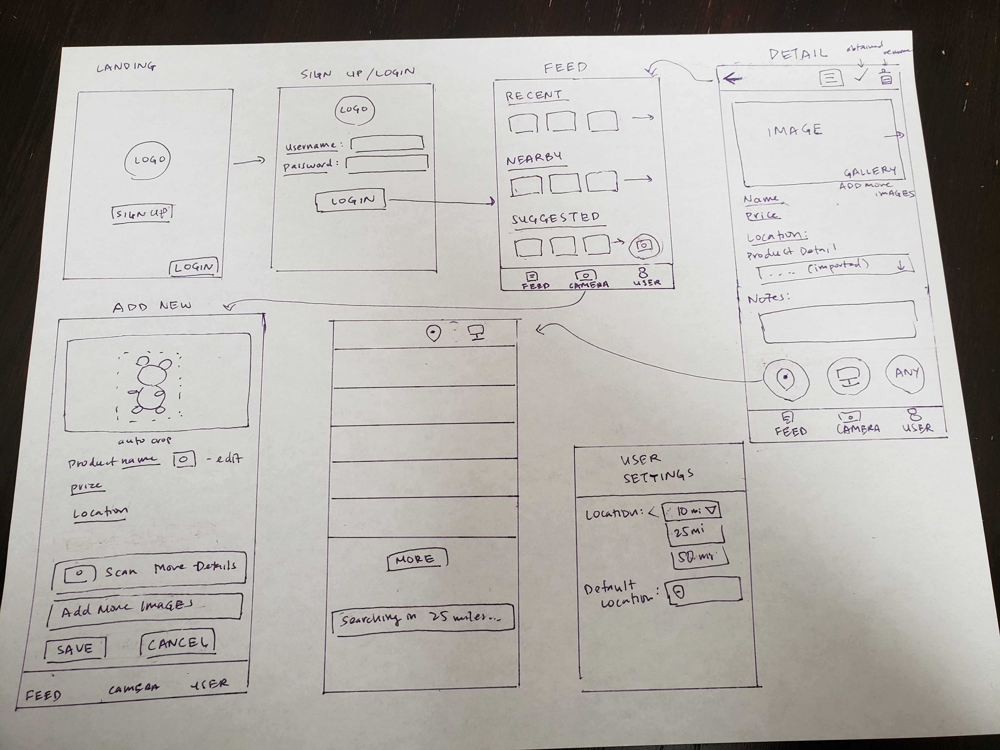

===

# Shopping Assistant

## Table of Contents
1. [Overview](#Overview)
2. [Product Spec](#Product-Spec)
3. [Wireframes](#Wireframes)
4. [Schema](#Schema)
5. [Milestone Walkthroughs](#Milestone-Walkthroughs)

## Overview
### Description

The aim is to build a shopping assistant app that will provide a seamless search capability for searching products on e-commerce websites using images captured by mobile cameras and it will show all related information of products with more descriptions, prices, and nearby store location options. 
Users can sort search results with cheaper prices, nearby locations, etc. Users can save search products that you've found but want to buy later to their account/profile and can see them.

### App Evaluation
- **Category:**
    - Shopping 
- **Mobile:**
    - User will be able to use their phone and take pictures of items.
    - The app can add additional information automatically, such as location that the picture was taken (i.e. which store they found the item).
    - In addition, a user will be able to scan an item and get a list of nearby stores with the item in stock (i.e. nearby stores holding the same item)
- **Story:**
    - When looking to purchase an item in store, you can use this app to get additional information that might not be displayed on the in person description/display. 
    - You can also get price/detail comparisons for the product at stores near your location and whether you can purchase it online.
    - A usecase would be if you're in a store and you want more details, or even if you're not in a store, you can ask the app to identify it and give you details on where to purchase it
- **Market:**
    - Market would be anyone who wants to buy something that they found but doesn't have enough details about the item they are looking for.
- **Habit:**
    - Would be used by any potential shopper that is looking to buy a product, but is unsure what features an item may provide or how it works or the price of the item.
    - Could also be used by shoppers who want to save an item to buy later and want to remember where it was found.
- **Scope:**
    - Full implementation might need some very in depth work such as computer vision/machine learning, online search, geolocation api, etc. A lot of api's will need to be utilized for full functionality.
    - A stripped down version might still be interesting to make, but it might not be as useful depending on which features will be ultimately implemented.

## Product Spec

### 1. User Stories (Required and Optional)

**Required Must-have Stories**

- User can take a picture of an item and save the item and some details for later
- - Storing item details (images, price, details, etc) that a user would want to buy but decided to save for later
- The app can search online for similar items and populate details in a list
- User can save the item to a persisted database, including details of the price and location that the item was found (if it's in a shop, details can be automatically populate with image processing + google maps)
- User can see a list of previously saved items
- User can see a detailed view of the item, with included saved information that the app retrieved from the search (product details + similar items from search)
- User can send the detailed view of item to another user to view

**Optional Nice-to-have Stories**

- Automatically recognize and populate details of an item by taking a picture of it
    - Would require image processing, computer vision, machine learning api's
- Item comparison between items of the same type (case: user is shopping for a fridge and they want to compare fridges that they have saved)
- Searching for items based on a user filter (i.e. they want to look for a fridge of a particular size... but this might be a hard thing to do for multiple types of items)
- User can add notes and comments to the item that they saved
- Sharing an item's details (or a list of items) to someone else who has the app to view and comment on)
  - Would require a way for users to interact with a system
- Recommended items may also list other user's discovered items nearby
  - Need to answer just how many details might be shared among users, i.e. privacy concerns in sharing users' images

### 2. Screen Archetypes

* Landing Page
    - [x] Home page with a stylized logo that will ask the user for a log in or sign up option.
     - [x] User will click on login button and will be redirected to a login page.
     - [x] If user does not have an account, user should click on the sign up button and will be redirected to a register page.
   
* Login/Signup
   - [x] User will either be directed to a login or sign up page.
   - [x] Database that will check whether or not a specific user exists for the site.
   - [ ] If user does not exist, then save the data that is input into the text box after the submit button is pressed. Data will be stored in a database for persistence.

* Bottom Navigation
    - [x] (List) Feed
    - [x] (Camera) Take a picture
    - [x] (User) User Settings

* List Screen / Page of items after Login or Sign Up
    - [x] After login show a feed of saved lists and pictures that were taken previously. 
    - [ ] Have functionality in the Login page to click on the camera button to take a new picture.
    - [ ] New account will not have a feed of saved items, so just display the layout along with functionality to click camera for a new picture.
    - [ ] Click on an item to see its detailed view

* Take a Picture Screen
    - [x] User will be redirected to the camera app to take a picture
    - [ ] After the user takes a picture, details will be automatically populated: price, name, location. User will be asked to confirm whether the details of the item is correct
      - [ ] If the user confirms that the details are correct, user is redirected to detailed item view
      - [x] If the user wants to add details manually, redirect to add details manually
      - [x] User can also choose to retake the picture
    - [ ] If details cannot be found automatically, user has the option to add details manually or to retake the picture

* Add Details Manually
    - [x] User can update product name, price, location
    - [ ] Location integration w/ google maps
    - [x] User can update notes on the product
    - [ ] User can take more pictures to add additional details
    - [ ] User can add more pictures to the item

* Detailed Item View
    - [ ] User can view item details including name, price, location found
    - [ ] User can view a gallery of pictures of the item
    - [ ] Additionally, user can click on a button to search for recommended nearby or online items based on this item's details and redirects to Search List View
    - [ ] Additionally, user can send the details of this item to a user via a external messaging app of their choice

* Search List View
    - [ ] Show the existing item that the search was made on
    - [x] Shows list of items found based on an existing item
    - [x] Each item has a link to item that it found online (external link)

* User Settings
    - [ ] User can change their email
    - [ ] User can change their password
    - [ ] User can set defaults for location (default location, if location cannot be found, and default radius to search)

### 3. Navigation

**Tab Navigation** (Tab to Screen)

* List screen / Home feed
* Take picture tab
* User tab

**Flow Navigation** (Screen to Screen)

* Landing
  * Login / Sign up
* Login / Sign up
  * Feed
* Feed
  * Feed
  * Camera
  * User
  * Item Detail View
* Camera
  * Details Found
  * No Details Found
* Details Found
  * Add Details
  * View Details
  * (Retake Picture) Camera
  * (Back/Cancel) Feed
* No Details Found
  * (Retake Picture) Camera
  * Add Details
  * (Back/Cancel) Feed
* View Details
  * Search
  * Share Details Externally
  * (Back) Feed
* Search
  * External Item Link
  * (Back) View Details
* User Page

## Wireframes




### [BONUS] Digital Wireframes & Mockups

Made with balsamiq.cloud.

Project link [here](https://balsamiq.cloud/svjx0yg/psf9cvc/r7923).

Landing Page > Signup / Login


Signup / Login > Feed


Feed (Basic View)


Feed (with More Features)


Details Found (Screen after taking a picture)


No Details Found (Screen after taking a picture)


Add Details (After selecting to add more details)


Add Details (More features)


View Details (After successfully adding details)


Search (Clicking on search nearby or online buttons)


User Options


### [BONUS] Interactive Prototype

## Schema 

### Models

#### User

| Property              | Type                | Description                                                              |
|-----------------------|---------------------|--------------------------------------------------------------------------|
| userId                | String              | unique id for the user (default field)                                   |
| email                 | String              | email for the user                                                       |
| password              | String              | password for the user                                                    |
| defaultLocation       | Pointer to Location | a location for the user for search criteria, if nothing else is provided |
| defaultLocationRadius | Number              | a radius in miles for search criteria, if nothing else is provided       |
| createdAt             | DateTime            | date when user is created (default field)                                |
| updatedAt             | DateTime            | date when user is last updated (default field)                           |

#### Item

| Property     | Type                | Description                                    |
|--------------|---------------------|------------------------------------------------|
| itemId       | String              | unique id for the item (default field)         |
| user         | Pointer to User     | user who created this item                     |
| location     | Pointer to Location | location that this item was found              |
| name         | String              | name of item                                   |
| price        | Number              | price of the item                              |
| details      | String              | details about the item                         |
| brand        | String              | (optional) brand of the item                   |
| externalLink | String              | external link associated with the item         |
| isArchived   | Boolean             | whether the item is archived by the user       |
| createdAt    | DateTime            | date when item is created (default field)      |
| updatedAt    | DateTime            | date when item is last updated (default field) |

#### [Relational] ItemRecommendedItem (One-to-many)

| Property              | Type                       | Description                                                                         |
|-----------------------|----------------------------|-------------------------------------------------------------------------------------|
| itemRecommendedItemId | String                     | unique id for the relationship between an item and recommended item (default field) |
| item                  | Pointer to Item            | an item                                                                             |
| recommendedItem       | Pointer to RecommendedItem | a recommended item that is related to the item                                      |
| createdAt             | DateTime                   | date when relationship is created (default field)                                   |
| updatedAt             | DateTime                   | date when relationship is last updated (default field)                              |

#### RecommendedItem

| Property          | Type                | Description                                        |
|-------------------|---------------------|----------------------------------------------------|
| recommendedItemId | String              | unique id for the recommended item (default field) |
| location          | Pointer to Location | location that this item was found                  |
| name              | String              | name of item                                       |
| price             | Number              | price of the item                                  |
| details           | String              | details about the item                             |
| brand             | String              | (optional) brand of the item                       |
| externalLink      | String              | external link associated with the item             |
| createdAt         | DateTime            | date when item is created (default field)          |
| updatedAt         | DateTime            | date when item is last updated (default field)     |
 
#### Picture

| Property    | Type            | Description                                       |
|-------------|-----------------|---------------------------------------------------|
| pictureId   | String          | unique id for the picture (default field)         |
| item        | Pointer to Item | item that the picture is related to               |
| description | String          | text description of the picture                   |
| pictureFile | File            | the file of the picture                           |
| createdAt   | DateTime        | date when picture is created (default field)      |
| updatedAt   | DateTime        | date when picture is last updated (default field) |

#### Location

| Property    | Type     | Description                                        |
|-------------|----------|----------------------------------------------------|
| locationId  | String   | unique id for the location (default field)         |
| descriptor  | String   | an identifying description of the location         |
| coordinates | String   | the coordinates of the location                    |
| createdAt   | DateTime | date when location is created (default field)      |
| updatedAt   | DateTime | date when location is last updated (default field) |

Note: This table will integrate w/ Google Maps, so schema may change
 
## Networking

### List of network requests and Snippets by screen

#### Take a Picture Screen
**(Create/POST) Post the picture to the backend for image processing, extract the name and price, search for the closest item online based on the name/details, and return name and price, and details (if found)**
(Cloud Vision API)[https://cloud.google.com/vision/docs/ocr#vision_text_detection_gcs-java]: using snippet from here for text detection in an image. Also look into integration w/ (Google's Firebase ML)[https://firebase.google.com/docs/ml].
Search API: ? Could use Google, but has limitations. Will have to search for an alternative.

Cloud Vision API Request:

```java
    List<String> extractedText = new ArrayList<>();
    // Detects text in the specified local image.
    public static void detectText(String filePath) throws IOException {
        List<AnnotateImageRequest> requests = new ArrayList<>();

        ByteString imgBytes = ByteString.readFrom(new FileInputStream(filePath));

        Image img = Image.newBuilder().setContent(imgBytes).build();
        Feature feat = Feature.newBuilder().setType(Feature.Type.TEXT_DETECTION).build();
        AnnotateImageRequest request =
            AnnotateImageRequest.newBuilder().addFeatures(feat).setImage(img).build();
        requests.add(request);

        // Initialize client that will be used to send requests. This client only needs to be created
        // once, and can be reused for multiple requests. After completing all of your requests, call
        // the "close" method on the client to safely clean up any remaining background resources.
        try (ImageAnnotatorClient client = ImageAnnotatorClient.create()) {
            BatchAnnotateImagesResponse response = client.batchAnnotateImages(requests);
            List<AnnotateImageResponse> responses = response.getResponsesList();

            for (AnnotateImageResponse res : responses) {
                if (res.hasError()) {
                    Log.d("CloudVision", "Error: " + res.getError().getMessage());
                    return;
                }

                // For full list of available annotations, see http://g.co/cloud/vision/docs
                for (EntityAnnotation annotation : res.getTextAnnotationsList()) {
                    Log.d("CloudVision", "Text: " + annotation.getDescription());
                    Log.d("CloudVision", "Position: " + annotation.getBoundingPoly());
                    extractedText.add(annotation.getDescription());
                }
            }
        }
    }

    // do something with extractedText
```

Search API: [TODO]

**(External API) post to Google Maps, to ask for the location that the user took this picture and get additional details for this picture**
Notes for integration: (Location Permissions)[https://developer.android.com/training/location/permissions], (Getting Current Location)[https://developer.android.com/training/location/retrieve-current]

Location:

```java
fusedLocationClient.getCurrentLocation()
        .addOnSuccessListener(this, new OnSuccessListener<Location>() {
            @Override
            public void onSuccess(Location location) {
                // Got last known location. In some rare situations this can be null.
                if (location != null) {
                    // Logic to handle location object
                    latitude = location.getLatitude();
                    longitude = location.getLongitude();
                }
            }
        });
```

Google Maps API Request:

May specifically narrow down types, according to (this)[https://developers.google.com/maps/documentation/places/web-service/supported_types]. Ideally, we want only business establishments only.

```java
OkHttpClient client = new OkHttpClient().newBuilder()
  .build();
Request request = new Request.Builder()
  .url("https://maps.googleapis.com/maps/api/place/nearbysearch/json?location={latitude}%{longitude}&radius=1500&key=YOUR_API_KEY")
  .method("GET", null)
  .build();
Response response = client.newCall(request).execute();
```

**(Create/POST) When user confirms the details, picture and item details, and location data is saved to the database**
`Note: https://github.com/templates-back4app/android-relations-java/blob/main/app/src/main/java/com/emre/one_to_many_java/book/AddBookActivity.java`

```java
ParseObject item, picture, location;

location = new ParseObject("Location");
location.put("descriptor", descriptor);
location.put("coordinates", coordinates);

// get any existing location, or save new location
location.saveInBackground(e -> {
    if (e == null) {
        // location saved
        // assume we can use location immediately, otherwise will need to fetch it again
    }
    else {
        Log.d("Location", "Error: " + e.getMessage());
    }
});

item = new ParseObject("Item");
item.put("name", name);
item.put("price", price);
item.put("details", details);
item.put("brand", brand);
item.put("externalLink", externalLink);
item.put("user", getCurrentUser());
item.put("location", location); // previous saved ParseObject

item.saveInBackground(e => {
    if (e == null) {
        // item saved
        // assume we can use item immediately, otherwise will need to fetch it again
    }
    else {
        Log.d("Location", "Error: " + e.getMessage());
    }
});

picture = new ParseObject("Picture");
picture.put("description", description);
picture.put("pictureFile", new ParseFile(pictureFile));
picture.put("item", item); // pointer to item

picture.saveInBackground(e => {
    if (e == null) {
        // picture saved
    }
    else {
        Log.d("Location", "Error: " + e.getMessage());
    }
});

```

#### User Settings
**(Update/PUT) Update user email**

```android
ParseQuery<ParseObject> query = ParseQuery.getQuery("User");
ParseUser parseUser = ParseUser.getCurrentUser();
query.whereEqualTo("userID", parseUser);
query.findInBackground(new FindCallback<ParseObject>() {
    public void done(List<ParseObject> list, ParseException e) {
        if (e == null) {
            ParseObject person = list.get(0);
            person.put("email", emailAddress.getText().toString());
            person.saveInBackground();
        } else {
            Log.d("score", "Error: " + e.getMessage());
        }
    }
 });
```

**(Update/PUT) Update user password**
```android
ParseQuery<ParseObject> query = ParseQuery.getQuery("User");
ParseUser parseUser = ParseUser.getCurrentUser();
query.whereEqualTo("userID", parseUser);
query.findInBackground(new FindCallback<ParseObject>() {
    public void done(List<ParseObject> list, ParseException e) {
        if (e == null) {
            ParseObject person = list.get(0);
            person.put("password", password.getText().toString());
            person.saveInBackground();
        } else {
            Log.d("score", "Error: " + e.getMessage());
        }
    }
 });
```

**(Update/PUT) Update user default location**
```android
ParseQuery<ParseObject> query = ParseQuery.getQuery("User");
ParseUser parseUser = ParseUser.getCurrentUser();
query.whereEqualTo("userID", parseUser);
query.findInBackground(new FindCallback<ParseObject>() {
    public void done(List<ParseObject> list, ParseException e) {
        if (e == null) {
            ParseObject person = list.get(0);
            person.put("defaultLocation", defaultLocation.getText().toString());
            person.saveInBackground();
        } else {
            Log.d("score", "Error: " + e.getMessage());
        }
    }
 });
```

**(Update/PUT) Update user location radius search**
```android
ParseQuery<ParseObject> query = ParseQuery.getQuery("User");
ParseUser parseUser = ParseUser.getCurrentUser();
query.whereEqualTo("userID", parseUser);
query.findInBackground(new FindCallback<ParseObject>() {
    public void done(List<ParseObject> list, ParseException e) {
        if (e == null) {
            ParseObject person = list.get(0);
            person.put("defaultLocationRadius", defaultLocationRadius.getText().toString());
            person.saveInBackground();
        } else {
            Log.d("score", "Error: " + e.getMessage());
        }
    }
 });
```

#### Search List
**(Read/GET) Based on the criteria (item, location, radius, online (y/n), search for recommended items in a certain area and return a list of those items**
```android 
ParseUser parseUser = ParseUser.getCurrentUser();
ParseQuery<ParseObject> query = new ParseQuery("items");
query.setLimit(25);
query.whereEqualTo("userID", ParseUser);
ParseQuery<ParseObject> parseInnerQuery = new ParseQuery<>("location");
ParseQuery<ParseObject> parseInnerQuery2 = new ParseQuery<>("User");
if(productName.getText().toString() != null){
	query.whereEqualTo("name", productName.getText().toString());
}
if(productPrice.getText().toString() != null){
query.whereEqualTo("price", productPrice.getText().toString());
}
query.whereMatchesQuery("userID", parseInnerQuery2);
query.whereMatchesQuery("defaultLocation", parseInnerQuery2);
query.whereMatchesQuery("defaultLocationRadius", parseInnerQuery2);
query.whereMatchesQuery("locationId", parseInnerQuery);
query.include("locationId");
query.findInBackground(new FindCallback<ParseObject>() {
    @Override
    public void done(List<ParseObject> list, ParseException e) {

        if (e == null && list != null && list.size() != 0) {
            List<Item> itemList = new ArrayList<Item>();
            for (ParseObject parseObject : list) {
                itemList.add(Item.getItemById(getValue(parseObject, "itemID")));
            }
            masterItemAdapter.setItems(itemList);
            } else {
			Log.e(TAG,"Something wrong!!",e);
			return;
        }
    }
});
```
**(Create/POST) Save a recommended item to the database, in relation to the item**
```android
ParseQuery<ParseObject> recommendedItem, itemRecommendedItem, location;

location = new ParseQuery.getQuery("Location");
location.put("descriptor", descriptor);
location.put("coordinates", coordinates);

// get any existing location, or save new location
location.saveInBackground(e -> {
    if (e == null) {
        // location saved
        // assume we can use location immediately, otherwise will need to fetch it again
    }
    else {
        Log.d("Location", "Error: " + e.getMessage());
    }
});

recommendedItem = new ParseQuery.getQuery("RecommendedItem");
recommendedItem.put("name", name);
recommendedItem.put("price", price);
recommendedItem.put("details", details);
recommendedItem.put("externalLink", externalLink);
recommendedItem.put("location", location); // previous saved ParseObject

recommendedItem.saveInBackground(e => {
    if (e == null) {
        // recommendedItem saved
        // assume we can use recommendedItem immediately, otherwise will need to fetch it again
    }
    else {
        Log.d("Location", "Error: " + e.getMessage());
    }
});

Date currentTime = Calendar.getInstance().getTime();

itemRecommendedItem = new ParseQuery.getQuery("ItemRecommendedItem");
itemRecommendedItem.put("itemRecommendedItemId", itemRecommendedItemId);
itemRecommendedItem.put("itemId", item); // pointer to item
itemRecommendedItem.put("recommendedItemId", recommendedItem);
itemRecommendedItem.put("createdAt", currentTime);

itemRecommendedItem.saveInBackground(e => {
    if (e == null) {
        // itemRecommendedItem saved
    }
    else {
        Log.d("Location", "Error: " + e.getMessage());
    }
});
```

#### Detailed Item

**(Read/GET) Get item, item details, item picture, item locations, and all recommended items that were previously saved**
```android 
ParseUser parseUser = ParseUser.getCurrentUser();
ParseQuery<ParseObject> query = new ParseQuery("items");
query.setLimit(25);
query.whereEqualTo("userID", ParseUser);
ParseQuery<ParseObject> parseInnerQuery = new ParseQuery<>("location");
ParseQuery<ParseObject> parseInnerQuery2 = new ParseQuery<>("User");
ParseQuery<ParseObject> parseInnerQuery3 = new ParseQuery<>("Picture");
ParseQuery<ParseObject> parseInnerQuery4 = new ParseQuery<>("ItemRecommendedItem");
ParseQuery<ParseObject> parseInnerQuery5 = new ParseQuery<>("RecommendedItem");
query.whereMatchesQuery("userID", parseInnerQuery2);
query.whereMatchesQuery("defaultLocation", parseInnerQuery2);
query.whereMatchesQuery("defaultLocationRadius", parseInnerQuery2);
query.whereMatchesQuery("itemId", parseInnerQuery3);
query.whereMatchesQuery("itemId", parseInnerQuery4);
parseInnerQuery4.whereMatchesQuery("recommendedItemId", parseInnerQuery5);
query.whereMatchesQuery("locationId", parseInnerQuery);
query.selectKeys(Arrays.asList("itemId","name", "price","details","brand","externalLink","isArchived"));
query.include("locationId");
query.findInBackground(new FindCallback<ParseObject>() {
    @Override
    public void done(List<ParseObject> list, ParseException e) {

        if (e == null && list != null && list.size() != 0) {
            List<Item> itemList = new ArrayList<Item>();
            for (ParseObject parseObject : list) {
                itemList.add(Item.getItemById(getValue(parseObject, "itemID")));
            }
            masterItemAdapter.setItems(itemList);
            } else {
			Log.e(TAG,"Something wrong!!",e);
			return;
        }
    }
});
```

**(Read/GET) Get a short string containing details of the item (that the user can then copy and message; or this could be created on the app side)**
```android
ParseUser parseUser = ParseUser.getCurrentUser();
ParseQuery<ParseObject> query = new ParseQuery("items");
query.whereEqualTo("userID", ParseUser);
query.whereEqualTo("itemId", itemID.getValue());
query.include("externalLink");
query.findInBackground(new FindCallback<ParseObject>() {
    @Override
    public void done(List<ParseObject> list, ParseException e) {

        if (e == null && list != null && list.size() == 1) {
            List<Item> itemList = new ArrayList<Item>();
            for (ParseObject parseObject : list) {
                itemList.add(Item.getItemById(getValue(parseObject, "externalLink")));
            }
            masterItemAdapter.setExternalLink(itemList);
            } else {
			Log.e(TAG,"Something wrong!!",e);
			return;
        }
    }
});
```

**(Delete) Delete an item from database**

```android
ParseQuery<ParseObject> query = ParseQuery.getQuery("items");
query.whereEqualTo("itemId", itemID.getValue());
query.getInBackground(objectId, new GetCallback<ParseObject>() {
  public void done(ParseObject object, ParseException e) {
    if (e == null) {
       object.deleteInBackground();
    } else {
      Log.e(TAG,"Something wrong in delete Item",e);
	  return;
    }
  }
});
```

**[Optional] (Update/PUT) Archives an item, user doesn't get bothered by it anymore, but they can view it (somewhere)**
```android
ParseQuery<ParseObject> query = ParseQuery.getQuery("User");
ParseUser parseUser = ParseUser.getCurrentUser();
query.whereEqualTo("userID", parseUser);
query.whereEqualTo("itemId", itemId.getValue());
query.findInBackground(new FindCallback<ParseObject>() {
    public void done(List<ParseObject> list, ParseException e) {
        if (e == null) {
            ParseObject person = list.get(0);
            person.put("isArchived", (isArchived.getValue()==0 ? 1: 0));
            person.saveInBackground();
        } else {
            Log.d("score", "Error: " + e.getMessage());
        }
    }
 });
```

- [OPTIONAL: List endpoints if using existing API such as Yelp]

## Milestone Walkthroughs

### Milestone 1: Setup Projects and Designs


### Milestone 2: Essential Activity Functionality

Signup New User

Feed Page

Search Page


Take a Picture Screen


### Milestone 3: Additional Functionality

### Milestone 4: Refine Details